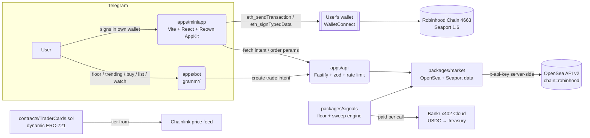

# HoodBazaar

Telegram-native, **fully non-custodial** NFT marketplace layer for **Robinhood Chain** (Arbitrum Orbit L2, chain ID **4663**).

The bot is the discovery & intelligence layer. All trades are signed by users **in their own wallets** via a Telegram Mini App. We never hold keys or funds — the backend only prepares **unsigned** Seaport order data.

## Architecture



**Trust model (hard rules)**

- No signing keys anywhere in this codebase; nothing sensitive is ever requested from users.
- Backend returns *unsigned* Seaport `OrderComponents` / fulfillment calldata; signatures happen only in the user's wallet (Mini App).
- The 1% marketplace fee is a **Seaport consideration item** paid to `TREASURY_ADDRESS` inside listings created through HoodBazaar — no escrow contract. Buys of third-party listings pass through OpenSea's fulfillment data unmodified.
- `OPENSEA_API_KEY`, `TELEGRAM_BOT_TOKEN`, `BANKR_API_KEY` live in `.env` server-side only.

## Verified chain constants

| Constant | Value | Source |
|---|---|---|
| Chain ID | `4663` (`0x1237`) | docs.robinhood.com/chain + live `eth_chainId` |
| Public RPC | `https://rpc.mainnet.chain.robinhood.com` | docs.robinhood.com/chain/connecting |
| Alchemy RPC | `https://robinhood-mainnet.g.alchemy.com/v2/<key>` | same |
| Explorer | `https://robinhoodchain.blockscout.com` | same |
| Testnet | chain ID `46630`, `rpc.testnet.chain.robinhood.com` | same |
| OpenSea chain slug | `robinhood` | opensea-js `Chain` enum |
| Seaport 1.6 | `0x0000000000000068F116a894984e2DB1123eB395` | bytecode verified on 4663 via `eth_getCode` |

## Getting started

```bash
# Node 20+, pnpm 9
pnpm install
cp .env.example .env        # fill in TELEGRAM_BOT_TOKEN, OPENSEA_API_KEY, TREASURY_ADDRESS
cp apps/miniapp/.env.example apps/miniapp/.env   # VITE_REOWN_PROJECT_ID from cloud.reown.com

pnpm build                  # builds packages in dependency order
pnpm test                   # unit tests (market, api, signals, bot parser)
```

### 1. Market data + bot (read-only value on day one)

```bash
pnpm api     # Fastify on :8787 (needed for buy/list intents)
pnpm bot     # long-polling Telegram bot
```

Verify: message the bot — `trending`, `floor <collection>`, `watch <collection>`, `portfolio 0x…`. Health check: `curl localhost:8787/healthz` → `{"ok":true,"chain":4663}`.

### 2. Trade intents (Seaport order building)

- `POST /v1/trade-intents` `{type:"buy",collection,count}` → picks the cheapest listings, returns summary + intent id.
- `POST /v1/trade-intents/:id/order-parameters` (list flow) → unsigned `OrderComponents` with the fee consideration + EIP-712 payload; counter is read on-chain at request time.
- `POST /v1/trade-intents/:id/fulfillment` (buy flow) → exact Seaport calldata from OpenSea fulfillment data for the connected buyer.
- `POST /v1/trade-intents/:id/submit-listing` → relays the *user-signed* order to the OpenSea orderbook.

All endpoints are zod-validated and rate-limited (60 req/min/IP).

### 3. Mini App (signing)

```bash
pnpm miniapp   # Vite dev server on :5173
```

Point BotFather's Mini App URL (or the inline `webApp` button URL, `MINIAPP_URL` in `.env`) at your deployed HTTPS miniapp. Flow: connect wallet (Reown AppKit) → confirmation card (item, price, 1% fee, gas estimate) → sign in wallet. Listings are gasless EIP-712 signatures; a one-time `setApprovalForAll` to the OpenSea conduit is prompted when needed.

### 4. Paid signals (x402)

```bash
pnpm --filter @hoodbazaar/signals serve   # local harness on :8890
curl "localhost:8890/signal?collection=<slug>"                    # → HTTP 402 + payment terms
curl -H "x-payment: mock" "localhost:8890/signal?collection=<slug>"  # → signal JSON (dev only)
```

Production deploy via Bankr x402 Cloud (auth with `BANKR_API_KEY`):

```bash
bankr x402 deploy --entry packages/signals/src/x402.ts \
  --price 0.25 --token USDC --wallet <TREASURY_ADDRESS> --name hoodbazaar-signals
```

Agents pay USDC on Base per call; revenue settles straight to the treasury. Payments are only collected on successful responses.

### 5. Trader Cards contract

```bash
cd contracts
forge test          # 16 tests — tiers, staleness, mint, withdraw, dynamic URI
```

Deploy (signer from an encrypted Foundry keystore — `cast wallet import deployer`):

```bash
PRICE_FEED=<chainlink-feed-on-4663> MAX_SUPPLY=1000 MINT_PRICE_WEI=10000000000000000 \
BULL_THRESHOLD=400000000000 BEAR_THRESHOLD=200000000000 CARDS_OWNER=<treasury> \
forge script script/Deploy.s.sol --rpc-url robinhood --account deployer --broadcast
```

> ⚠️ `PRICE_FEED` must be a real Chainlink AggregatorV3 feed **on Robinhood Chain** — verify availability at data.chain.link before mainnet deploy; the script takes it as input on purpose so nothing is guessed.

Metadata is 100% on-chain (base64 JSON + SVG); tier = Bull / Crab / Bear from the feed, Unknown if the feed is stale (>24h) or invalid. `GET /v1/metadata/trader-cards/:id` on the API mirrors it over HTTP once `TRADER_CARDS_ADDRESS` is set.

## Monorepo layout

| Path | What | Verify |
|---|---|---|
| `packages/market` | OpenSea v2 client (chain=robinhood), chain constants, sweep detection | `pnpm --filter @hoodbazaar/market test` |
| `packages/signals` | accumulation/distribution engine + x402 handler | `pnpm --filter @hoodbazaar/signals test` |
| `apps/bot` | grammY bot — discovery only, never touches funds | `pnpm --filter @hoodbazaar/bot test` |
| `apps/api` | Fastify — intents, unsigned Seaport orders, proxies, metadata | `pnpm --filter @hoodbazaar/api test` |
| `apps/miniapp` | Reown AppKit signing UI | `pnpm --filter @hoodbazaar/miniapp build` |
| `contracts` | TraderCards ERC-721 + tests + deploy script | `forge test` |

## Deployment notes

- **bot/api**: any Node 20 host (Railway/Fly/VPS). Set env from `.env.example`. The bot uses long polling — no inbound port needed.
- **miniapp**: static hosting with HTTPS (Vercel/Cloudflare Pages). Telegram requires HTTPS for Mini Apps. Set `MINIAPP_URL` in the bot env and register the URL with BotFather.
- **signals**: Bankr x402 Cloud (above). Keep the local harness for CI smoke tests.
- **contracts**: deploy once, verify on Blockscout (`--verify --verifier blockscout --verifier-url https://robinhoodchain.blockscout.com/api`).

## Out of scope (v1)

Token launch/fees/claiming (manual, operator-side), custodial wallets, user API keys, custom AMM/escrow contracts, non-Robinhood chains.
